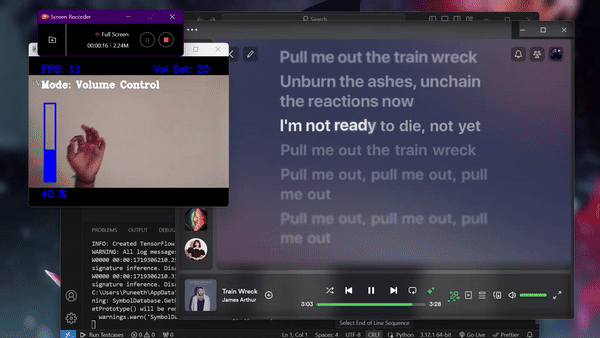

<div align="center">
  <h1>Gesture Volume Control Using OpenCV and MediaPipe</h1>
  
</div>

> This project uses OpenCV and MediaPipe to control system volume, take screenshots, and play/pause media using hand gestures.

## 💾 REQUIREMENTS
+ opencv-python
+ mediapipe
+ comtypes
+ numpy
+ pycaw
+ pyautogui

```bash
pip install -r requirements.txt
```
### MEDIAPIPE
<div align="center">
  
</div>

> MediaPipe offers open source cross-platform, customizable ML solutions for live and streaming media.

#### Hand Landmark Model
After the palm detection over the whole image our subsequent hand landmark model performs precise keypoint localization of 21 3D hand-knuckle coordinates inside the detected hand regions via regression, that is direct coordinate prediction. The model learns a consistent internal hand pose representation and is robust even to partially visible hands and self-occlusions.

To obtain ground truth data, we have manually annotated ~30K real-world images with 21 3D coordinates, as shown below (we take Z-value from image depth map, if it exists per corresponding coordinate). To better cover the possible hand poses and provide additional supervision on the nature of hand geometry, we also render a high-quality synthetic hand model over various backgrounds and map it to the corresponding 3D coordinates.<br>

#### Solution APIs
##### Configuration Options
> Naming style and availability may differ slightly across platforms/languages.

+ <b>STATIC_IMAGE_MODE</b><br>
If set to false, the solution treats the input images as a video stream. It will try to detect hands in the first input images, and upon a successful detection further localizes the hand landmarks. In subsequent images, once all max_num_hands hands are detected and the corresponding hand landmarks are localized, it simply tracks those landmarks without invoking another detection until it loses track of any of the hands. This reduces latency and is ideal for processing video frames. If set to true, hand detection runs on every input image, ideal for processing a batch of static, possibly unrelated, images. Default to false.

+ <b>MAX_NUM_HANDS</b><br>
Maximum number of hands to detect. Default to 2.

+ <b>MODEL_COMPLEXITY</b><br>
Complexity of the hand landmark model: 0 or 1. Landmark accuracy as well as inference latency generally go up with the model complexity. Default to 1.

+ <b>MIN_DETECTION_CONFIDENCE</b><br>
Minimum confidence value ([0.0, 1.0]) from the hand detection model for the detection to be considered successful. Default to 0.5.

+ <b>MIN_TRACKING_CONFIDENCE:</b><br>
Minimum confidence value ([0.0, 1.0]) from the landmark-tracking model for the hand landmarks to be considered tracked successfully, or otherwise hand detection will be invoked automatically on the next input image. Setting it to a higher value can increase robustness of the solution, at the expense of a higher latency. Ignored if static_image_mode is true, where hand detection simply runs on every image. Default to 0.5.

<br>

Source: [MediaPipe Hands Solutions](https://github.com/google-ai-edge/mediapipe)

<div align="center">
    
    
    
</div>

### 📝 CODE EXPLANATION

<b> Importing Libraries </b>

```py
import cv2
import mediapipe as mp
import math
import numpy as np
from ctypes import cast, POINTER
from comtypes import CLSCTX_ALL
from pycaw.pycaw import AudioUtilities, IAudioEndpointVolume
import pyautogui

```

### Initialize Mediapipe hands module
```py
mpHands = mp.solutions.hands
hands = mpHands.Hands(static_image_mode=False, max_num_hands=1, min_detection_confidence=0.7, min_tracking_confidence=0.5)
mpDraw = mp.solutions.drawing_utils

```

### Initialize PyCaw for volume control
```py
devices = AudioUtilities.GetSpeakers()
interface = devices.Activate(IAudioEndpointVolume._iid_, CLSCTX_ALL, None)
volume = cast(interface, POINTER(IAudioEndpointVolume))
volRange = volume.GetVolumeRange()
minVol = volRange[0]
maxVol = volRange[1]
volBar = 400
volPer = 0
colorVol = (255, 0, 0)
volLocked = False

```

### Camera settings
```py
wCam, hCam = 640, 480
cap = cv2.VideoCapture(1)
cap.set(3, wCam)
cap.set(4, hCam)
pTime = 0
```

### Utility function to find hand landmarks and bounding box
```py
def findHands(img):
    imgRGB = cv2.cvtColor(img, cv2.COLOR_BGR2RGB)
    results = hands.process(imgRGB)
    if results.multi_hand_landmarks:
        for handLms in results.multi_hand_landmarks:
            mpDraw.draw_landmarks(img, handLms, mpHands.HAND_CONNECTIONS)
    return img, results
```

### Utility function to find position of hand landmarks
```py
def findPosition(img, results, handNo=0):
    xList = []
    yList = []
    bbox = []
    lmList = []
    if results.multi_hand_landmarks:
        myHand = results.multi_hand_landmarks[handNo]
        for id, lm in enumerate(myHand.landmark):
            h, w, c = img.shape
            cx, cy = int(lm.x * w), int(lm.y * h)
            xList.append(cx)
            yList.append(cy)
            lmList.append([id, cx, cy])
            cv2.circle(img, (cx, cy), 5, (255, 0, 255), cv2.FILLED)
        xmin, xmax = min(xList), max(xList)
        ymin, ymax = min(yList), max(yList)
        bbox = xmin, ymin, xmax, ymax
        cv2.rectangle(img, (bbox[0] - 20, bbox[1] - 20), (bbox[2] + 20, bbox[3] + 20), (0, 255, 0), 2)
    return lmList, bbox
```

### Utility function to determine which fingers are up
```py
def fingersUp(lmList):
    tipIds = [4, 8, 12, 16, 20]
    fingers = []
    if lmList[tipIds[0]][1] > lmList[tipIds[0] - 1][1]:
        fingers.append(1)
    else:
        fingers.append(0)
    for id in range(1, 5):
        if lmList[tipIds[id]][2] < lmList[tipIds[id] - 2][2]:
            fingers.append(1)
        else:
            fingers.append(0)
    return fingers
```

### Utility function to find distance between two points
```py
def findDistance(p1, p2, lmList, img):
    x1, y1 = lmList[p1][1], lmList[p1][2]
    x2, y2 = lmList[p2][1], lmList[p2][2]
    cx, cy = (x1 + x2) // 2, (y1 + y2) // 2
    cv2.circle(img, (x1, y1), 15, (255, 0, 255), cv2.FILLED)
    cv2.circle(img, (x2, y2), 15, (255, 0, 255), cv2.FILLED)
    cv2.line(img, (x1, y1), (x2, y2), (255, 0, 255), 3)
    cv2.circle(img, (cx, cy), 15, (255, 0, 255), cv2.FILLED)
    length = math.hypot(x2 - x1, y2 - y1)
    return length, img, [x1, y1, x2, y2, cx, cy]

modes = ["Volume", "Screenshot", "MediaControl"]
modeIdx = 0
mode = modes[modeIdx]

while True:
    success, img = cap.read()
    img, results = findHands(img)
    lmList, bbox = findPosition(img, results)

    if len(lmList) != 0:
        area = (bbox[2] - bbox[0]) * (bbox[3] - bbox[1]) // 100

        if 250 < area < 1000:
            fingers = fingersUp(lmList)

            # Switch modes: Pinky and thumb up, others down
            if fingers == [1, 0, 0, 0, 1]:
                modeIdx = (modeIdx + 1) % len(modes)
                mode = modes[modeIdx]
                time.sleep(1)  # Avoid rapid mode switching

            if mode == "Volume":
                if volLocked:
                    cv2.putText(img, 'Volume Locked', (400, 100), cv2.FONT_HERSHEY_SIMPLEX, 1, (0, 0, 255), 3)
                else:
                    length, img, lineInfo = findDistance(4, 8, lmList, img)
                    volBar = np.interp(length, [50, 200], [400, 150])
                    volPer = np.interp(length, [50, 200], [0, 100])
                    smoothness = 10
                    volPer = smoothness * round(volPer / smoothness)

                    if not fingers[4]:
                        volume.SetMasterVolumeLevelScalar(volPer / 100, None)
                        cv2.circle(img, (lineInfo[4], lineInfo[5]), 15, (0, 255, 0), cv2.FILLED)
                        colorVol = (0, 255, 0)
                    else:
                        colorVol = (255, 0, 0)

                # Lock/Unlock Volume: Middle finger and thumb touching, others down
                if fingers == [1, 0, 1, 0, 0]:
                    volLocked = not volLocked
                    time.sleep(1)  # Avoid rapid toggling

            elif mode == "Screenshot":
                if fingers == [1, 1, 0, 0, 0]:  # Index and thumb are touching
                    pyautogui.screenshot().save(f'Screenshot_{time.time()}.png')
                    modeIdx = 0  # Switch back to Volume mode

            elif mode == "MediaControl":
                if fingers == [1, 1, 0, 0, 0]:  # Index and thumb are touching
                    pyautogui.press('playpause')
                    modeIdx = 0  # Switch back to Volume mode

    cv2.rectangle(img, (50, 150), (85, 400), (255, 0, 0), 3)
    cv2.rectangle(img, (50, int(volBar)), (85, 400), (255, 0, 0), cv2.FILLED)
    cv2.putText(img, f'{int(volPer)} %', (40, 450), cv2.FONT_HERSHEY_SIMPLEX, 1, (255, 0, 0), 3)
    cVol = int(volume.GetMasterVolumeLevelScalar() * 100)
    cv2.putText(img, f'Vol Set: {int(cVol)}', (400, 50), cv2.FONT_HERSHEY_SIMPLEX, 1, colorVol, 3)
    
    if mode == "Volume":
        cv2.putText(img, 'Mode: Volume Control', (40, 100), cv2.FONT_HERSHEY_COMPLEX, 1, (255, 255, 255), 3)
    elif mode == "Screenshot":
        cv2.putText(img, 'Mode: Screenshot', (40, 100), cv2.FONT_HERSHEY_COMPLEX, 1, (255, 255, 255), 3)
    elif mode == "MediaControl":
        cv2.putText(img, 'Mode: Media Control', (40, 100), cv2.FONT_HERSHEY_COMPLEX, 1, (255, 255, 255), 3)

    cTime = time.time()
    fps = 1 / (cTime - pTime)
    pTime = cTime
    cv2.putText(img, f'FPS: {int(fps)}', (40, 50), cv2.FONT_HERSHEY_COMPLEX, 1, (255, 0, 0), 3)

    cv2.imshow("Img", img)
    cv2.waitKey(1)
```

<h1>### 👋 Gesture Controls</h1>

<h2>Switching Modes</h2>
Gesture: Pinky and thumb up, all other fingers down
Description: Switches between Volume, Screenshot, and Media Control modes

<h2>Volume Control Mode</h2>
Gesture: Normal behavior with index and thumb distance
Description: Adjusts the system volume

<h2>Lock/Unlock Volume:</h2>
Gesture: Touch middle finger and thumb, all other fingers down
Description: Locks and unlocks the volume

<h2>Screenshot Mode</h2>
Gesture: Touch index and thumb, all other fingers down
Description: Takes a screenshot

<h2>Media Control Mode</h2>
Gesture: Touch index and thumb, all other fingers down
Description: Plays/pauses media

<h1>📬 Contact</h1>
If you want to contact me, you can reach me through the below handles.
<div style="text-align: center;">
    <a href="https://www.linkedin.com/in/puneeth-reddy-6aa887287/">
         Puneeth Reddy</a>
    <br>
    <a href="https://www.instagram.com/madlad0x2/">
         Puneeth</a>
</div>

